<h1 align="center">DevLab - Self-Hosted Development Environment</h1>

<p align="center">
  A personal cloud infrastructure project that recreates a small-team development platform using Linux, Gitea, Nginx, Flask, Netdata, DNS, TLS, firewalling, and automated backups.
</p>

<div align="center">
  
  
  
  
  
</div>

---

## Table of Contents

- [Overview](#overview)
- [What This Project Shows](#what-this-project-shows)
- [Architecture](#architecture)
- [Technology Stack](#technology-stack)
- [Screenshots](#screenshots)
- [Repository Structure](#repository-structure)
- [Key Implementation Details](#key-implementation-details)
- [Replicating This Environment](#replicating-this-environment)
  - [Prerequisites](#prerequisites)
  - [Installation / Getting Started](#installation--getting-started)
  - [Usage](#usage)
- [Project Origin & Notes](#project-origin--notes)
- [Author](#author)
- [License](#license)

---

## Overview

DevLab is a self-hosted development environment built on an Ubuntu Server VM in Microsoft Azure. The project demonstrates how a small software team could run its own private source-code hosting, issue tracking, website, monitoring dashboard, internal DNS, and backup workflow without depending on managed platforms such as GitHub or GitLab.com.

The environment is intentionally built from standard Linux services rather than a single bundled platform. This made the project useful for practicing server administration, service hardening, reverse proxy configuration, systemd services, firewall rules, DNS records, and backup automation.

> **Note:** This is a personal portfolio project. The live VM deployed for my own use is usually powered off to save costs and only turned on for demos or maintenance. However, the instructions and scripts provided in this repository can be used to replicate the exact same setup on your own infrastructure.

## What This Project Shows

- Provisioned and administered an Ubuntu Server 24.04 LTS VM on Microsoft Azure.
- Deployed Gitea for self-hosted Git repositories, organizations, users, roles, branches, and issues.
- Configured Nginx as a static website host and reverse proxy.
- Built a small Flask unit-converter app and exposed it through Nginx.
- Configured HTTPS with a self-signed OpenSSL certificate.
- Set up Netdata for live CPU, RAM, disk, and network monitoring.
- Added internal DNS records with dnsmasq.
- Hardened access with Azure NSG, UFW, and SSH key authentication.
- Automated nightly backups using rsync and cron.
- Validated Git workflows from Windows and Ubuntu client VMs in VMware Workstation.

## Architecture

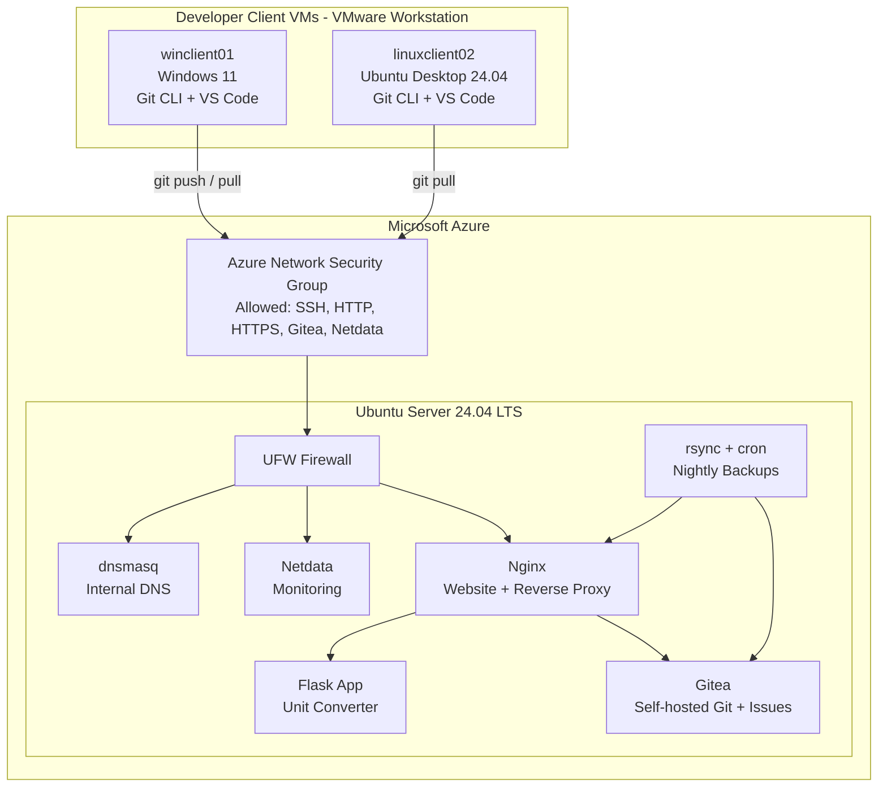

## Technology Stack

| Layer | Technology | Purpose |
| --- | --- | --- |
| Cloud | Microsoft Azure | VM hosting and public access |
| Server OS | Ubuntu Server 24.04 LTS | Host operating system |
| Version Control | Gitea 1.22.3 | Self-hosted Git and issue tracking |
| Web Server | Nginx | Static website and reverse proxy |
| Web App | Python Flask | Server-side unit converter |
| Monitoring | Netdata | Live system metrics |
| DNS | dnsmasq | Internal hostname resolution |
| Backup | rsync + cron | Scheduled backups |
| TLS | OpenSSL | Self-signed HTTPS certificate |
| Security | Azure NSG + UFW + SSH keys | Layered access control |
| Client VMs | Windows 11 and Ubuntu Desktop | Cross-platform Git workflow testing |

## Screenshots

| Area | Evidence |
| --- | --- |
| Gitea dashboard | 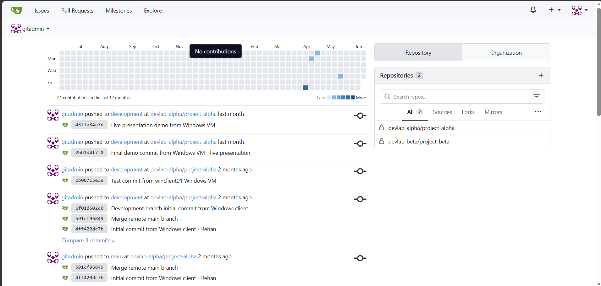 |
| Organizations and teams | 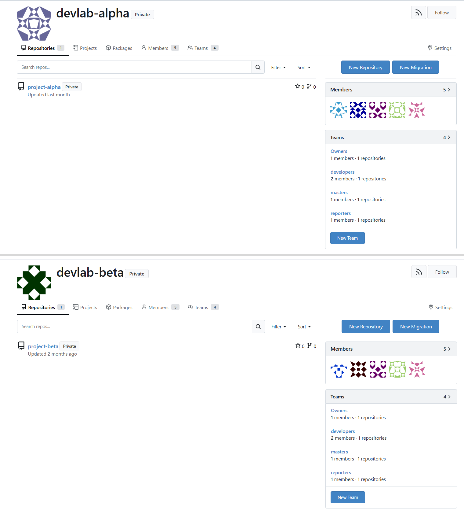 |
| Branch workflow | 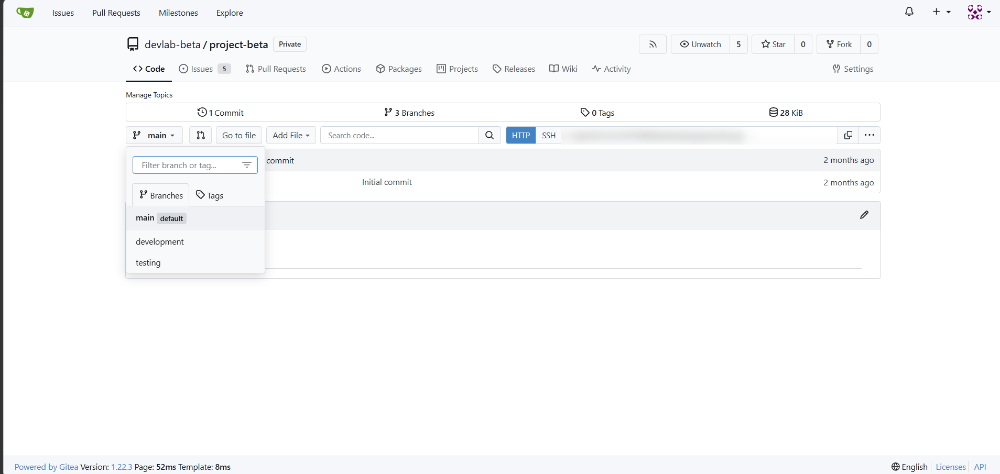 |
| Issues | 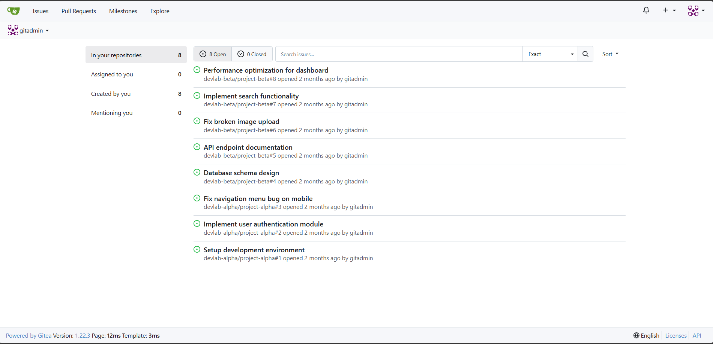 |
| Website homepage | 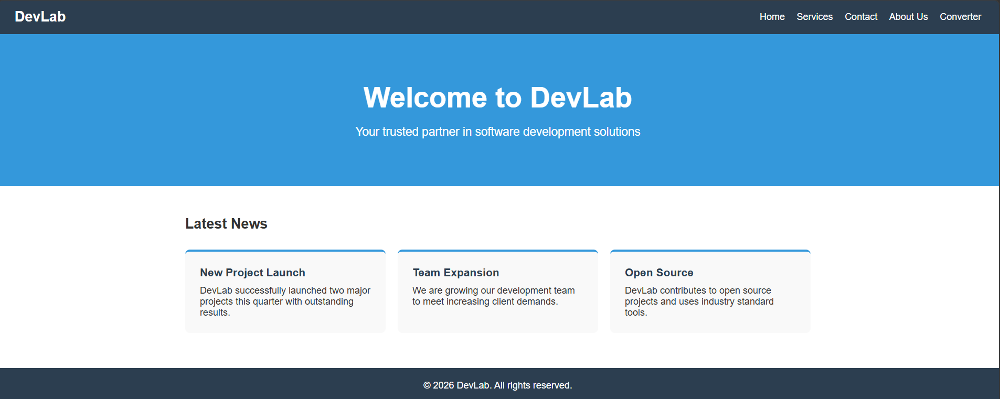 |
| Flask converter | 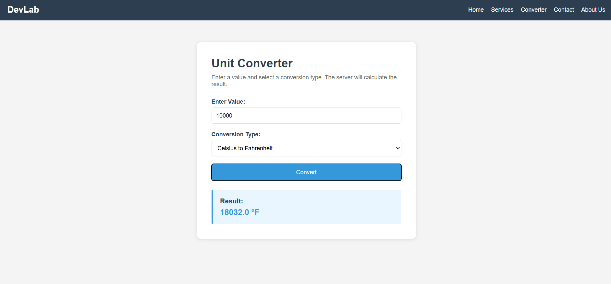 |
| Netdata monitoring | 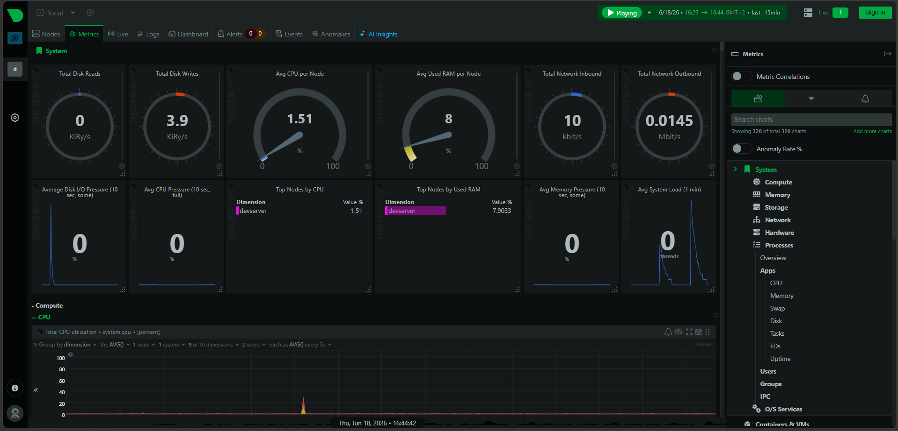 |
| Backup log | 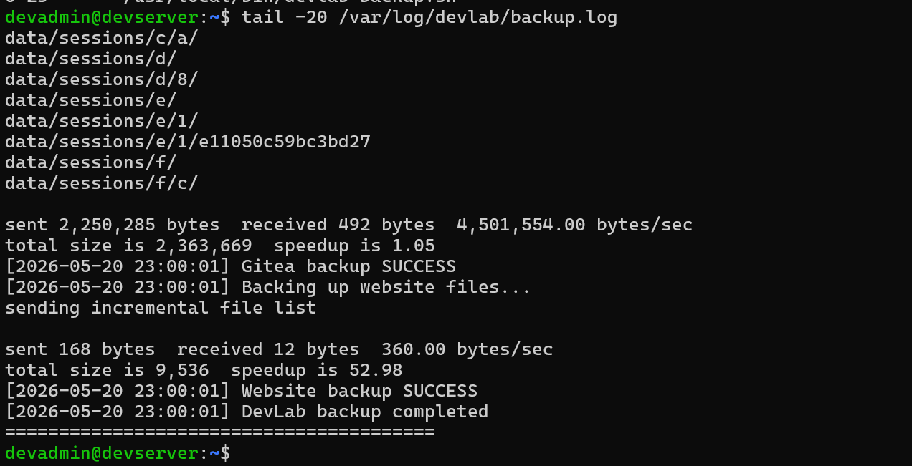 |
| Windows Git push | 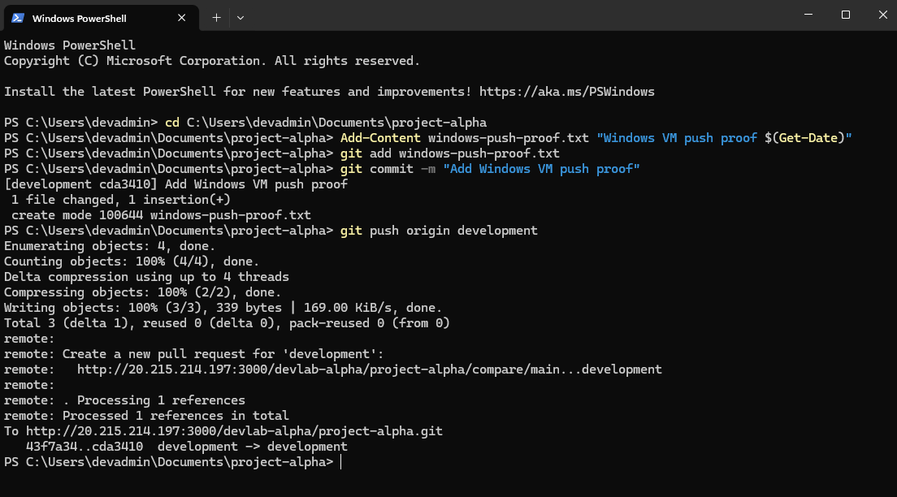 |
| Linux Git pull | 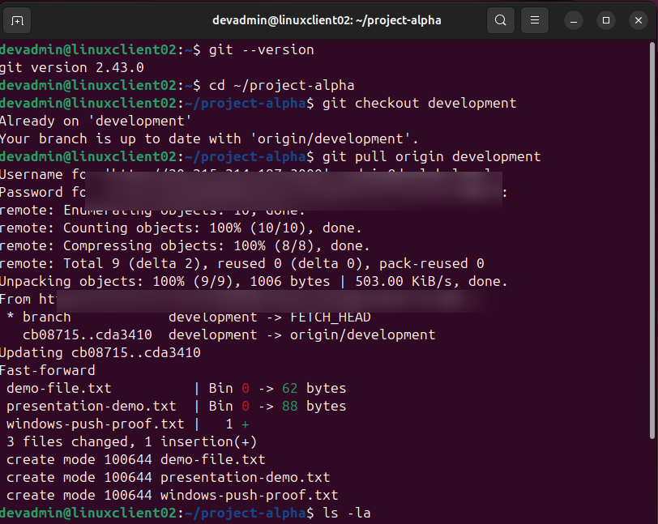 |
| VMware clients | 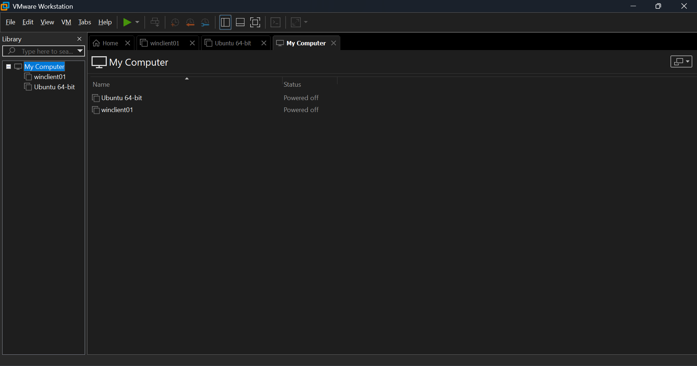 |

More screenshots are available in the [`screenshots/`](screenshots/) folder.

## Repository Structure

```text
devlab-development-environment/
├── README.md
├── app/
│   └── app.py
├── configs/
│   ├── dnsmasq.conf
│   └── nginx-devlab.conf
├── docs/
│   ├── architecture-notes.md
│   └── DevLab_Final_Documentation (1).docx
├── screenshots/
│   ├── README.md
│   └── *.png
└── scripts/
    ├── devlab-app.service
    ├── devlab-backup.sh
    ├── gitea.service
    └── setup-server.sh
```

## Key Implementation Details

### Gitea

Gitea was selected because it provides Git hosting, issue tracking, organizations, branch workflows, and role-based access while staying lightweight enough for a small VM. The environment includes two organizations and two repositories to simulate separate project teams.

### Nginx and Flask

Nginx serves the static website and proxies requests to the Flask unit-converter app. This separates the public web entry point from the internal application service and keeps routing centralized.

### Security

The server uses layered network controls:

- Azure NSG controls cloud-level inbound access.
- UFW controls host-level inbound access.
- SSH uses key-based authentication.
- Gitea public self-registration is disabled.
- Sensitive files such as SSH keys, certificates, `.env` files, logs, and Gitea `app.ini` are excluded by `.gitignore`.

### Backups

Backups are handled with a small shell script using `rsync`. A root cron job runs it every night at 23:00 and writes success/failure entries to a log file.

## Replicating This Environment

While my personal instance is kept offline to save resources, you can replicate this entire stack on your own server or VM. 

### Prerequisites

- A fresh Ubuntu 24.04 LTS machine (VM or bare-metal).
- A user account with `sudo` privileges.
- Basic familiarity with Linux command line and SSH.
- Allowed inbound ports on your firewall (e.g., 22 for SSH, 80 for HTTP, 443 for HTTPS, 3000 for Gitea, 19999 for Netdata).

### Installation / Getting Started

1. **Clone this repository** onto your server:
   ```bash
   git clone https://github.com/Rekh-225/devlab-development-environment.git
   cd devlab-development-environment
   ```

2. **Review configurations**:
   Before running the setup, review the files in the `configs/` and `scripts/` directories to ensure paths, domain names (if applicable), and IP addresses align with your needs.

3. **Run the setup script**:
   The `setup-server.sh` script automates much of the installation. Run it to set up dependencies, firewall rules, and services.
   *(Make sure to review the script before executing it to understand what it modifies on your system.)*
   ```bash
   chmod +x scripts/setup-server.sh
   sudo ./scripts/setup-server.sh
   ```

### Usage

Once your environment is built, you can access the various services at your server's IP address or configured domain name:

- **Nginx Static Site & Flask App:** `http://<your-server-ip>/` and `https://<your-server-ip>/`
- **Gitea:** `http://<your-server-ip>:3000` (First-time access will prompt you to set up an admin user and configure the database).
- **Netdata Monitoring:** `http://<your-server-ip>:19999`

## Project Origin & Notes

This project began as a hands-on operating systems lab build and is now maintained as a personal infrastructure and DevOps portfolio project. The HTTPS setup uses a self-signed certificate because the deployment uses an IP-based demo environment rather than a registered domain. 

## Author

**Rekh-225**
- GitHub: [@Rekh-225](https://github.com/Rekh-225)

## License

This repository is provided for educational and portfolio purposes. Configuration files and scripts may be adapted for similar lab environments.
