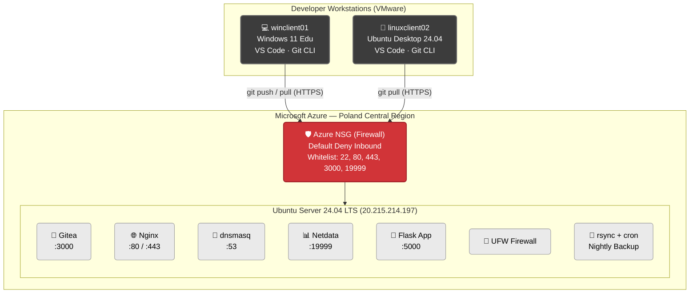

<h1 align="center">DevLab — Self-Hosted Development Environment & Web Service</h1>

<div align="center">
  
  
  
  
  
</div>

<br />

> **University Semester Project** · Operating Systems · Spring 2025–2026  
> **Obuda University** — John von Neumann Faculty of Informatics  
> BSc in Computer Science Engineering

---

## 📋 Table of Contents

- [Project Overview](#-project-overview)
- [Architecture](#-architecture)
- [Technology Stack](#-technology-stack)
- [Features Implemented](#-features-implemented)
- [Repository Structure](#-repository-structure)
- [Key Technical Decisions](#-key-technical-decisions)
- [Academic Context](#-academic-context)
- [License](#-license)

---

## 🚀 Project Overview

**DevLab** is a complete, production-style on-premise development environment tailored for a small software development team. The primary goal is to provide developers with full ownership and control over their source code, issue tracking, and corporate website—eliminating reliance on external cloud-based hosting platforms like GitHub or GitLab.com.

The entire stack is self-hosted on a **Microsoft Azure virtual machine** running **Ubuntu Server 24.04 LTS**, featuring all services configured, secured, and automated from scratch.

---

## 🏗️ Architecture

Below is the high-level architecture diagram demonstrating the interaction between developer workstations and the DevLab cloud infrastructure.



---

## 🛠️ Technology Stack

| Layer | Technology | Purpose |
|-------|------------|---------|
| **Cloud** | Microsoft Azure (Poland Central) | VM hosting, static public IP |
| **Server OS** | Ubuntu Server 24.04 LTS | All services host OS |
| **Version Control** | Gitea 1.22.3 | Self-hosted Git + issue tracker |
| **Web Server** | Nginx 1.24+ | Corporate website + reverse proxy |
| **DNS** | dnsmasq 2.89+ | Internal hostname resolution |
| **Monitoring** | Netdata (latest) | Real-time CPU/RAM/Disk/Network |
| **Backup** | rsync + cron | Nightly automated backup at 23:00 |
| **Web App** | Python Flask 3.x | Server-side unit converter |
| **TLS** | OpenSSL (self-signed) | HTTPS encryption |
| **Firewall** | Azure NSG + UFW | Dual-layer default-deny |
| **Client 1** | Windows 11 Education (VMware) | Developer workstation |
| **Client 2** | Ubuntu Desktop 24.04 (VMware) | Cross-platform client |
| **IDE** | Visual Studio Code | Development environment |
| **VCS Client** | Git CLI | Push/pull operations |

---

## ✅ Features Implemented

### 🦊 Version Control (Gitea)
- **Self-Hosted:** Git repository server with an integrated issue tracker.
- **Access Control:** Admin-only account creation (public self-registration disabled).
- **Organization:** 2 organizations (`devlab-alpha`, `devlab-beta`) and 2 repositories (`project-alpha`, `project-beta`).
- **Users:** 7 user accounts with role-based access (Owner / Writer / Reader).
- **Workflow:** Branch management (main + development + testing) and issue tracking (8 active issues).

### 🌐 Web Server (Nginx)
- **Corporate Website:** Hosted 4 pages (Home, Services, Contact, About Us).
- **Security:** HTTPS enabled with automatic HTTP → HTTPS redirection using a self-signed TLS certificate (RSA 2048-bit, OpenSSL).
- **Routing:** Acts as a reverse proxy for Gitea and the internal Flask application.

### 🐍 Web Application (Python Flask)
- **Service:** Server-side unit converter application.
- **Functionality:** 8 conversion types (e.g., km/miles, Celsius/Fahrenheit).
- **Integration:** Accessible via `/converter` on the main website, running as a systemd service proxied by Nginx.

### 🔧 Network & Monitoring
- **DNS (dnsmasq):** Internal resolution for `devlab.local` hostnames (`git`, `www`, `monitor`) with Google DNS fallback.
- **Monitoring (Netdata):** Real-time hardware dashboard (CPU, RAM, Disk I/O, Network) accessible at port 19999.
- **Backup (rsync + cron):** Automated nightly backups at 23:00 for Gitea repositories and website files.

### 🛡️ Security & Clients
- **Hardening:** Public key authentication only for SSH, dual firewall setup (Azure NSG + UFW) with default-deny inbound.
- **Client Validation:** Tested push/pull operations from both Windows 11 and Ubuntu Desktop 24.04 VMs using VS Code and Git CLI.

---

## 📁 Repository Structure

```text
devlab-development-environment/
├── README.md                          ← You are here
├── docs/
│   ├── DevLab_Documentation.pdf       ← Full project documentation (40+ pages)
│   └── architecture-diagram.md        ← Detailed architecture notes
├── configs/
│   ├── nginx-devlab.conf              ← Nginx virtual host config
│   ├── dnsmasq.conf                   ← dnsmasq DNS config
│   └── gitea-app.ini                  ← Gitea configuration (sanitised)
├── scripts/
│   ├── devlab-backup.sh               ← Nightly backup script
│   ├── setup-server.sh                ← Server baseline setup script
│   └── gitea-service.service          ← Gitea systemd service file
├── app/
│   └── app.py                         ← Python Flask unit converter
└── screenshots/
    ├── gitea-dashboard.png
    ├── website-https.png
    ├── netdata-dashboard.png
    ├── git-push-windows.png
    └── git-pull-linux.png
```

---

## 🧠 Key Technical Decisions

- **Why Gitea over GitLab?**  
  GitLab CE requires a minimum of 4 GB RAM just for itself, consuming the entire VM budget. Gitea provides all required features (Git hosting, issue tracker, role-based access, admin-only registration) using under 100 MB RAM.
  
- **Why rsync + cron over dedicated backup software?**  
  The task required a simple, auditable, scheduled backup. `rsync` is a battle-tested Unix tool that has been in production use since 1996. The backup script is ~20 lines—easy to verify, audit, and troubleshoot.
  
- **Why self-signed TLS over Let's Encrypt?**  
  The server uses a raw IP address rather than a registered domain name. Let's Encrypt requires domain validation and cannot issue certificates for bare IP addresses. A self-signed certificate provides the necessary encryption for an internal development environment.

---

## 🎓 Academic Context

This project serves as a comprehensive assignment for the **Operating Systems** course during the **Spring 2025–2026** semester at **Obuda University (John von Neumann Faculty of Informatics)**. It highlights practical skills in cloud deployment, server configuration, networking, and CI/CD pipelines.

---

## 📄 License

This project was created for educational purposes. All software components used are open-source. Configuration files and scripts in this repository are free to use and adapt.

<p align="center">
  <i>Built with ❤️ by an Obuda University Student</i>
</p>
